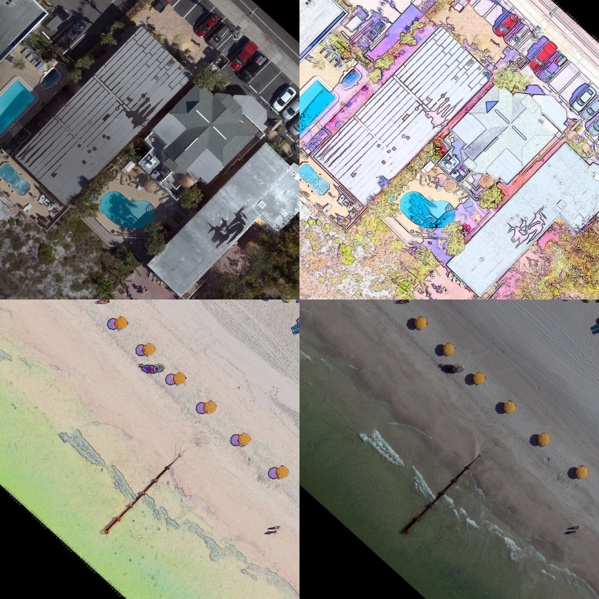

# "PBS" filter
PBS (pansharpening with background subtraction) method for sharpening RGB images

1. Read image, wavelet denoise, and convert to HSV
2. Do 'inverted background subtraction' on the V channel
3. combine with HS, convert to RGB

The effect is to sharpen details of object boundaries/transitions, brighten, and recolour

But without changing the overall distribution of values within the image (i.e. the range), and recolouring in an internally consistent (deterministic) way

Sample 'Madeira' imagery comes from https://coastal.er.usgs.gov/data-release/doi-P9L474WC/

Sample 'OBX' imagery comes from https://www.sciencebase.gov/catalog/item/6037cca0d34eb12031175133

0. Create a conda environment

A. Conda housekeeping

`conda clean --all`
`conda update -n base -c defaults conda`

B. Create new `pbs` conda environment

We'll create a new conda environment and install packages into it from conda-forge

`conda env create -f install/pbs.yml`

